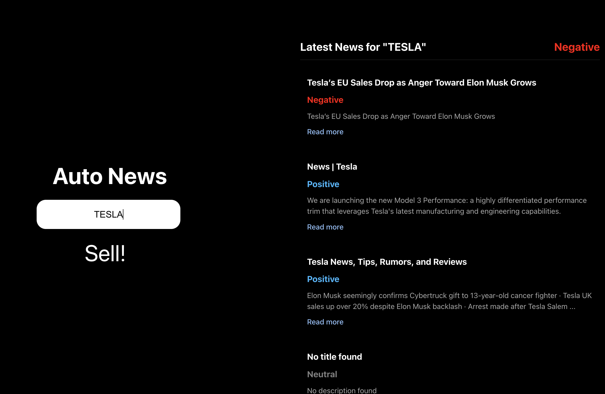
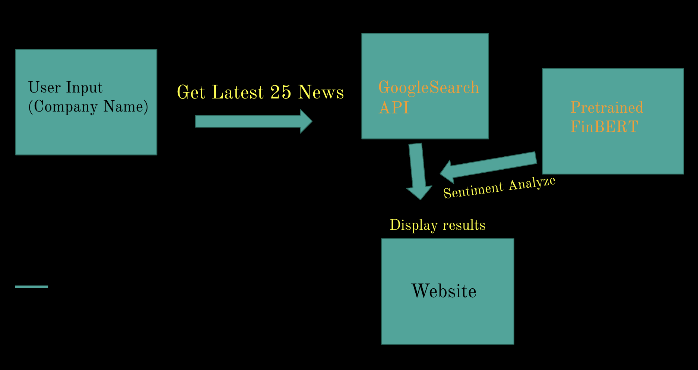

# Auto News




[](https://github.com/user-attachments/assets/97cf27e6-27e9-40d3-9951-ffe05de9c1b2)
https://github.com/user-attachments/assets/97cf27e6-27e9-40d3-9951-ffe05de9c1b2

Auto News is a web-based platform that allows users to enter a company name and receive real-time financial news. The website scrapes the latest articles from the web, evaluates their sentiment, and provides a final investment recommendation based on sentiment analysis.

## Features
- **Live Web Scraping**: Fetches the latest financial news about a given company in real-time.
- **Sentiment Analysis**: Analyzes the sentiment of news articles using NLP techniques.
- **Investment Recommendation**: Determines whether the sentiment is positive, negative, or neutral and provides an investment suggestion.
- **User-Friendly Interface**: Simple and intuitive UI for quick and easy analysis.

## Technologies Used
- **Python** (for backend processing)
- **Flask** (as the web framework)
- **googlesearch** (for web scraping latest financial news)
- **FinBERT** (for sentiment analysis; thanks to [FinBERT on Hugging Face](https://huggingface.co/yiyanghkust/finbert-tone))
- **React** (for frontend development)

## Installation
```bash
# Clone the repository
git clone https://github.com/axion66/StockTrading_based_on_financialnews.git
cd auto-news

# Install dependencies
pip install -r requirements.txt

# (optional) if no npm-setup, you need to do some "npm install" or nvm stuff.

# Run the application
python3 news_component/app.py

# Run the website
npm run dev
```

## Usage
1. Enter the name of a company in the search bar.
2. The website will fetch and analyze the latest financial news.
3. View the sentiment analysis and the final investment recommendation.

## Contributing
Contributions are welcome! Feel free to fork the repository and submit pull requests.

## License
This project is licensed under the **MIT License**. I'm happy to share for real.


